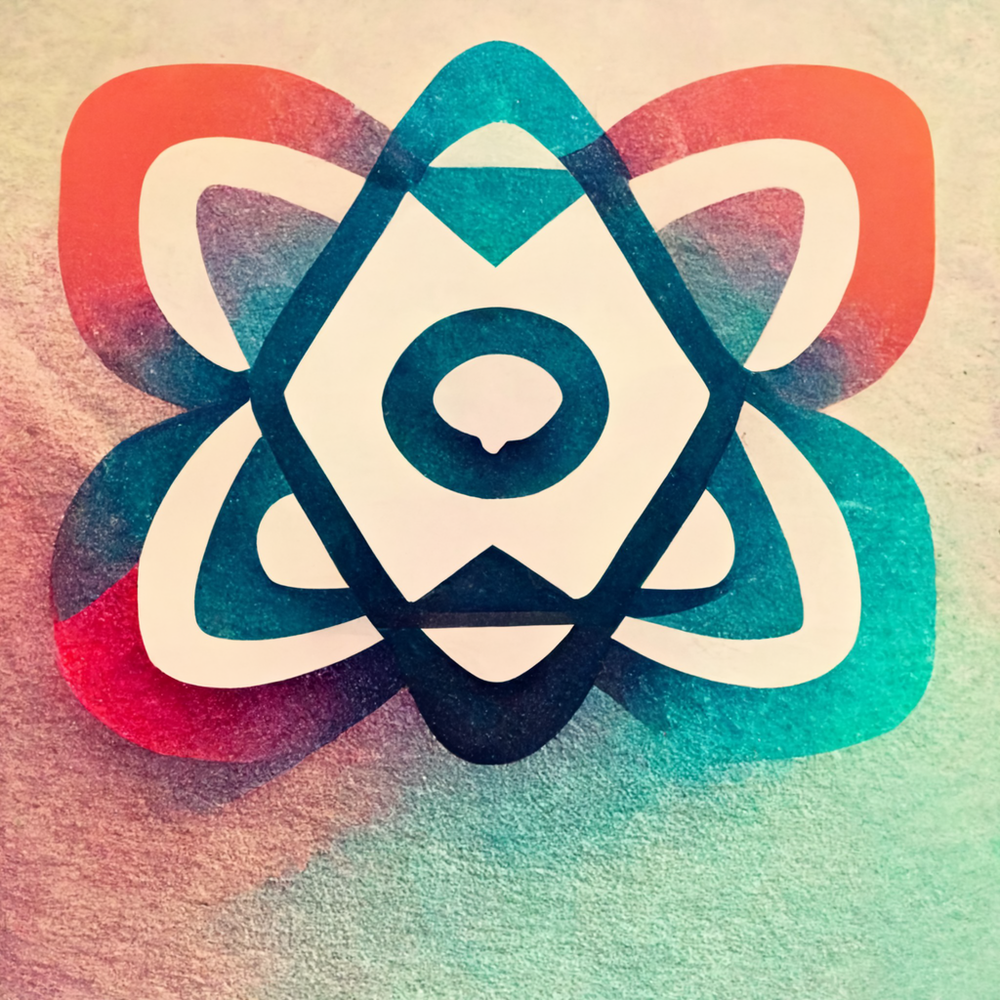
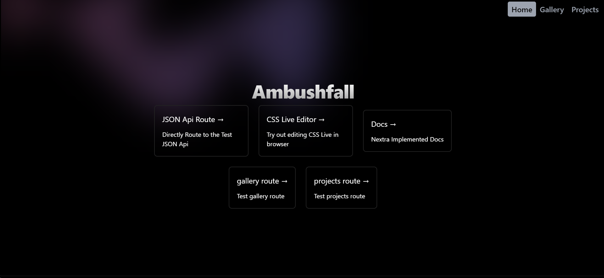

 

  

  <h3 align="center">TurboRepo</h3>

  

    Turborepo+Next+Nextra+TW [One click Deploy]
     
     
    <a href="https://ambushfall-next13-app.vercel.app/">View Demo</a>
    .
    <a href="https://github.com/Ambushfall/turborepo/issues">Report Bug</a>
    .
    <a href="https://github.com/Ambushfall/turborepo/issues">Request Feature</a>
  

 
  

## Table Of Contents

- [Table Of Contents](#table-of-contents)
- [About The Project](#about-the-project)
- [Built With](#built-with)
- [Contributing](#contributing)
- [Creating A Pull Request](#creating-a-pull-request)
- [License](#license)

## About The Project

Using all kinds of tech and consolidating them in a Monolith :)

## Built With

* [Next 13](https://nextjs.org/blog/next-13-4)
* [Nextra](https://nextra.site/)
* [Turborepo](https://turbo.build/)
* [TailwindCSS](https://tailwindcss.com/)

> ## Getting Started 
> [](https://vercel.com/new/clone?repository-url=https%3A%2F%2Fgithub.com%2FAmbushfall%2Fturborepo&env=PRS_ACC_TOK&envDescription=Github%20Personal%20Access%20Token&envLink=https%3A%2F%2Fgithub.com%2Fsettings%2Ftokens&project-name=monorepo-next13-nextra&repository-name=monorepo-next13-nextra&demo-title=turborepo&demo-description=Using%20all%20new%20tech%20intertwined%20into%20a%20monorepo%20for%20fun!&demo-url=https%3A%2F%2Fambushfall-next13-app.vercel.app%2F&demo-image=https%3A%2F%2Fraw.githubusercontent.com%2FAmbushfall%2Fturborepo%2Fmaster%2Fdemo%2Fdemo.png)

## Contributing

Contributions are what make the open source community such an amazing place to be learn, inspire, and create. Any contributions you make are **greatly appreciated**.
* If you have suggestions for adding or removing projects, feel free to [open an issue](https://github.com/Ambushfall/turborepo/issues/new) to discuss it, or directly create a pull request after you edit the *README.md* file with necessary changes.
* Please make sure you check your spelling and grammar.
* Create individual PR for each suggestion.
<!-- * Please also read through the [Code Of Conduct](https://github.com/Ambushfall/turborepo/blob/main/CODE_OF_CONDUCT.md) before posting your first idea as well. -->

## Creating A Pull Request

1. Fork the Project
2. Create your Feature Branch (`git checkout -b feature/AmazingFeature`)
3. Commit your Changes (`git commit -m 'Add some AmazingFeature'`)
4. Push to the Branch (`git push origin feature/AmazingFeature`)
5. Open a Pull Request

## License

Distributed under the MIT License. See [LICENSE](https://github.com/Ambushfall/turborepo/blob/main/LICENSE.md) for more information.